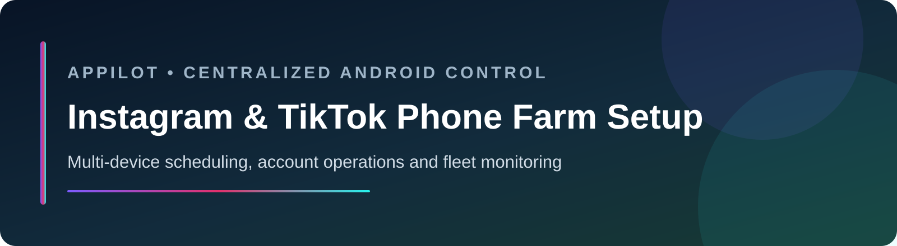
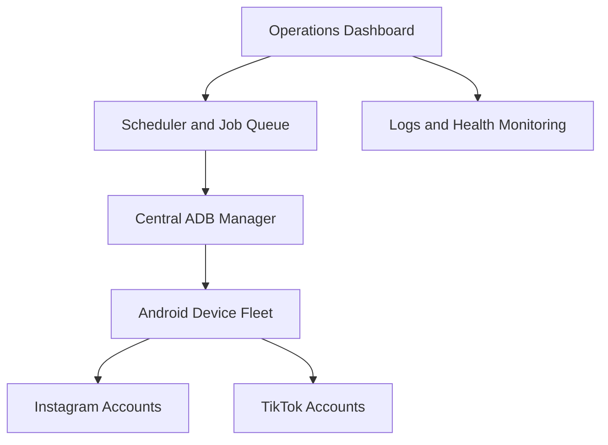
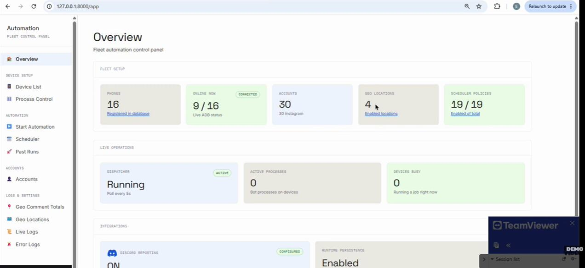
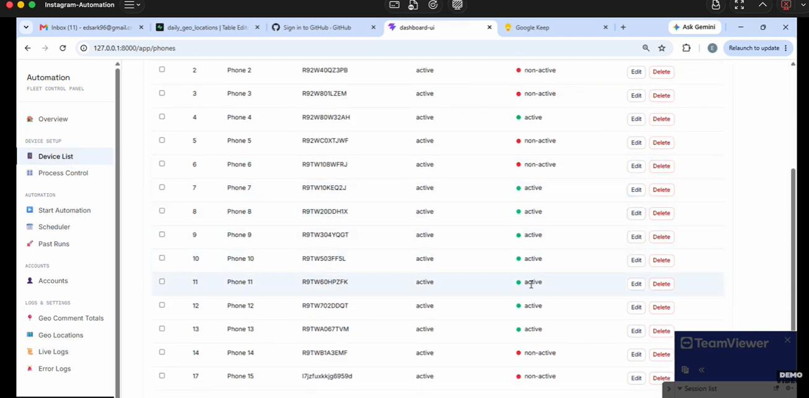
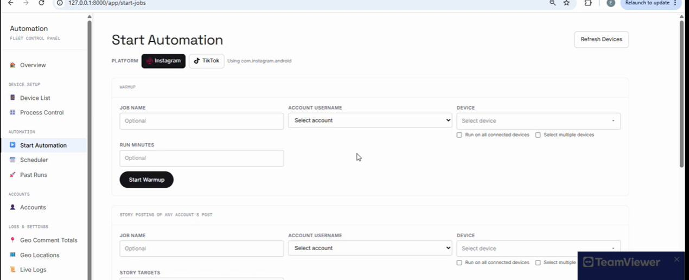
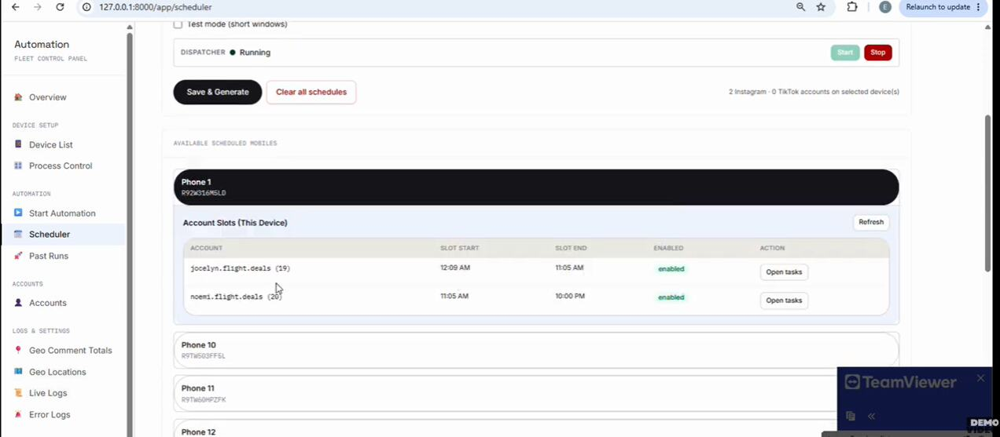
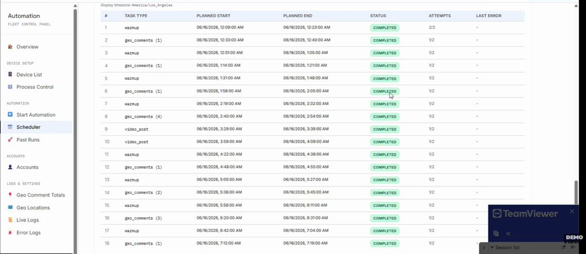
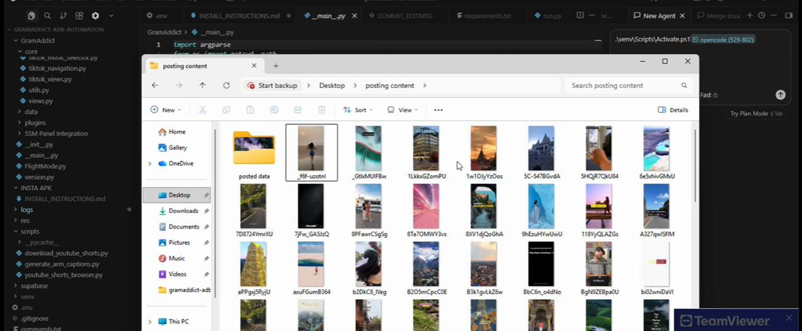
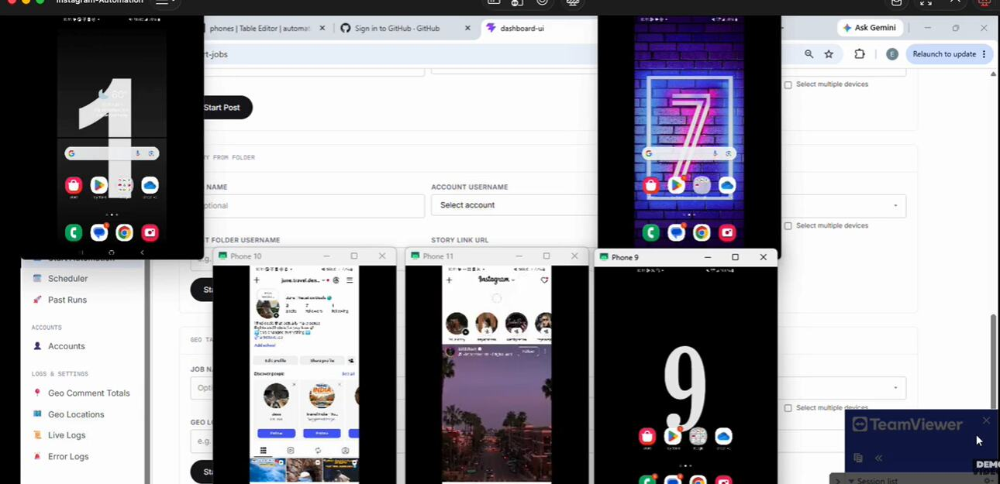

# Instagram & TikTok Phone Farm Setup

> Real-device Instagram and TikTok automation with centralized Android device management.

## Overview

This Instagram and TikTok phone farm setup provides a scalable control plane for coordinating workflows across a fleet of physical Android devices. It centralizes device visibility, account scheduling, content operations, geo-tag-based Instagram workflows, and controlled engagement activity in one operational dashboard.

The system supports authorized marketing workflows in the travel niche, with an emphasis on reliable ADB communication, device-level isolation, observability, and maintainable fleet operations.

## Project goals

- Manage a growing fleet of Android devices from one central machine.
- Coordinate multiple Instagram and TikTok accounts across isolated device sessions.
- Schedule approved content-posting and engagement workflows.
- Support location-aware Instagram workflows, including geo-tag-based commenting.
- Monitor device health, run status, errors, and account assignments at scale.

## Key capabilities

- **Centralized device management:** Discover, register, group, and monitor connected Android devices.
- **Multi-account scheduling:** Assign accounts and automation windows to individual devices.
- **Content operations:** Organize media, queues, and scheduled publishing workflows.
- **Geo-targeted workflows:** Configure Instagram activity around approved location targets.
- **Operational dashboard:** Review fleet availability, active runs, failures, and throughput.
- **Scalable architecture:** Designed to grow from an initial deployment to 20–100+ devices.

## System overview

## Product screenshots

### Fleet overview

### Device inventory

### Automation configuration

### Account and run management

### Account inventory

### Content library

### Live device operations

## Success criteria

- Production-ready management of 20–100+ Android devices.
- Stable device discovery and ADB communication.
- Reliable account-to-device assignment and scheduled execution.
- Observable posting and approved Instagram geo-tag workflows.
- Clear operator controls, run history, and failure recovery.

## Demo

Watch the [Instagram and TikTok phone farm setup demo](https://youtu.be/qghBMPEKXew).

Explore real-device automation at [Appilot](https://www.appilot.app/).
